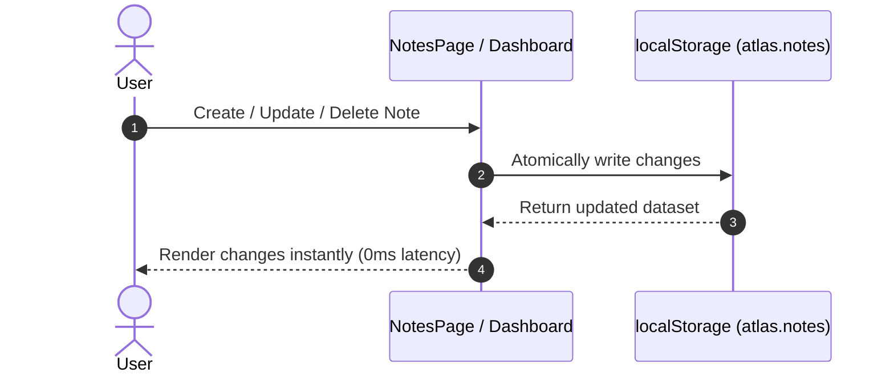
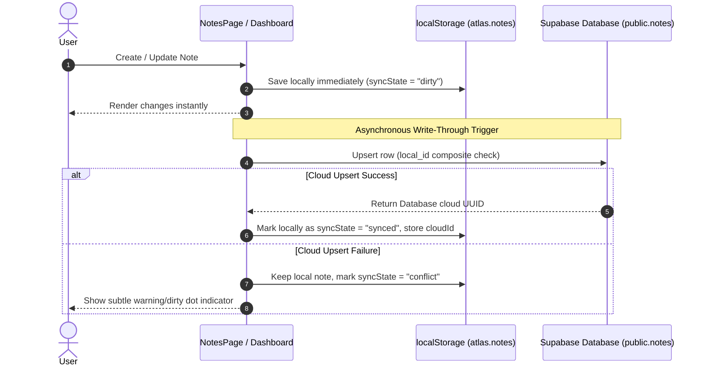

# Notes Sync Operations & Write-Through Architecture

This document outlines the execution model of the Notes sync system under **Local-Only** and **Cloud-Synced** modes, detailing how CRUD operations are coordinated between client-side cache (`localStorage`) and cloud database (Supabase).

---

## 1. Local-Only Mode

When Notes sync is not configured (or is disabled), operations behave strictly offline-first.

### CRUD Mechanics (Local-Only)
* **Create:** Generates client note with `syncState: "local_only"`. Writes immediately to `localStorage`.
* **Update:** Updates fields in-place. Sets `updatedAt` to now. Writes immediately to `localStorage`.
* **Delete:** Immediately removes the record from the local array in `localStorage`.

---

## 2. Cloud-Synced Mode (Write-Through)

When Notes sync status is marked `"synced"`, write-through activation triggers. The UI remains local-first to ensure 0ms latency, while background promises reconcile the cloud database in a safe, non-blocking manner.

### CRUD Mechanics (Cloud-Synced)

#### Create Note
1. **Local cache write:** The note is generated with `syncState: "dirty"` and written immediately to `localStorage`.
2. **Asynchronous push:** Dispatches `pushNoteToCloud(note)` via Supabase client.
3. **Reconciliation:**
   * On success: Updates local state to `syncState: "synced"` and saves the returned cloud `id` in `cloudId`.
   * On failure: Marks local note `syncState: "conflict"` representing a pending sync error. The note remains fully editable locally.

#### Update Note
1. **Local cache write:** Updates note values locally, sets `updatedAt` to now, sets `syncState: "dirty"`, and saves to `localStorage`.
2. **Asynchronous push:** Dispatches `pushNoteToCloud(note)` targeting the composite constraint on `(user_id, local_id)`.
3. **Reconciliation:**
   * On success: Marks `syncState: "synced"`.
   * On failure: Marks `syncState: "conflict"`.

#### Delete Note
1. **Local soft delete:** To prevent the cloud database from re-uploading the deleted note during future syncs, the note is flagged locally with `deletedAt: new Date().toISOString()` and `syncState: "dirty"`.
2. **UI Filtering:** The `useNotes` hook filters out any notes containing `deletedAt !== null` from the active array, so the deleted note disappears from all active UI views immediately.
3. **Asynchronous push:** Dispatches `pushNoteDeleteToCloud(note)` to set the database's `deleted_at` column.
4. **Reconciliation:**
   * On success: The note is permanently removed from the local `localStorage` array.
   * On failure: The note is preserved in `localStorage` with `deletedAt` (remaining hidden from the active UI) and marked `syncState: "conflict"`, allowing retries later.

---

## 3. Failure Behavior & Non-Blocking Design

* **Zero-Blocking UI:** Supabase writes are executed asynchronously inside React callback contexts. The user interface does not freeze or block during network delays.
* **Sign-out Resiliency:** If a user signs out while sync is enabled, local note writes continue to save locally as normal, flagging the notes as `"dirty"`. Banners in the settings page warn the user to sign back in.
* **RLS & Database Protection:** If a write is rejected by database Row-Level Security (RLS) or connection drops, the local note is preserved and marked with an error state, preventing any local data loss.

---

## 4. Deferred Sync Features

The following mechanisms are deferred in this phase and will be addressed in future sync updates:
* **Background Sync Queue:** Auto-retry engine that scans local `"dirty"` / `"conflict"` notes and pushes them automatically when page focus returns or network online event fires.
* **Conflict Resolution Triage Panel:** UI layout allowing users to manually inspect differences when a note is edited concurrently on two distinct devices.
* **Cross-Device Pull Refresh:** Automatic pull-to-refresh mechanism or real-time Supabase subscription triggers for incoming remote updates.
* **Periodic Reconciliation:** Scheduled interval sync to check consistency of local and cloud collections.
